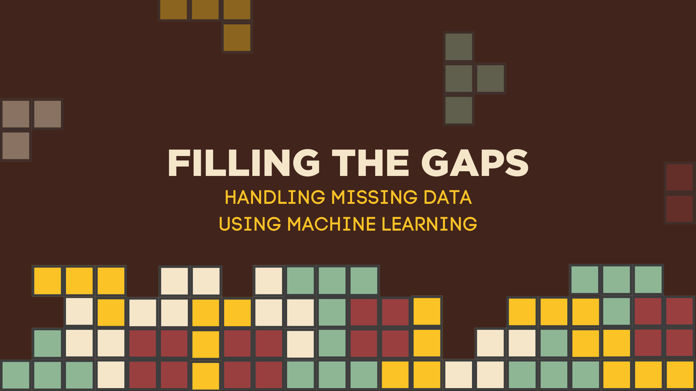

<h1></h1>

<h1>Project Description</h1>
In light of the pervasive integration of AI into decision-making processes, it becomes increasingly crucial to prioritize the fairness of these algorithms. The imperative here is to ensure that these systems remain unbiased and do not discriminate in favor of specific demographic groups, including considerations related to gender, race, or nationality. Upholding fairness in AI is not merely a technological concern but a fundamental ethical principle to prevent unjust disparities and promote equitable outcomes across diverse populations.

Concerns about fairness in data aren't new; they've been around long before AI became a big player. It's not simply a matter of dealing with biased data; the quality of how we handle and process this data is equally important. Fairness demands a comprehensive and thoughtful approach to both data itself and the processes that shape its interpretation and utilization.

One major issue about data quality is the presence of missing values. When these gaps exist in the dataset, they can disrupt the seamless flow of data through various processes in the analytical pipeline, such as data visualization. Missing values can also affect the predictive power of machine learning methods. This mini project explores machine learning imputation techniques to address the presence of missing values. As it turns out, when handling missing values, iterative imputation outperforms single imputation even without hypertuning on validation and holdout sets.
